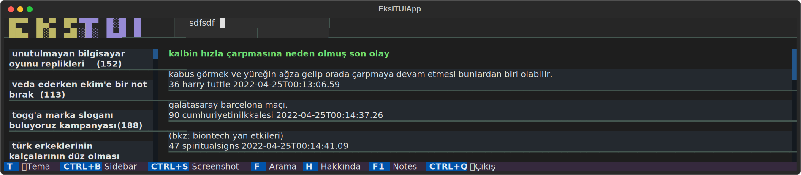

# eksitui

ekşi sözlük terminal user interface uygulaması.

### Install

```
pip install eksitui
```

### Usage

```
$ eksitui
```

```python
#    ctrl+b
#    f
#    tab
```

### dev

```
pip install "textual[dev]"
```

```
> textual run --dev eksitui
```
