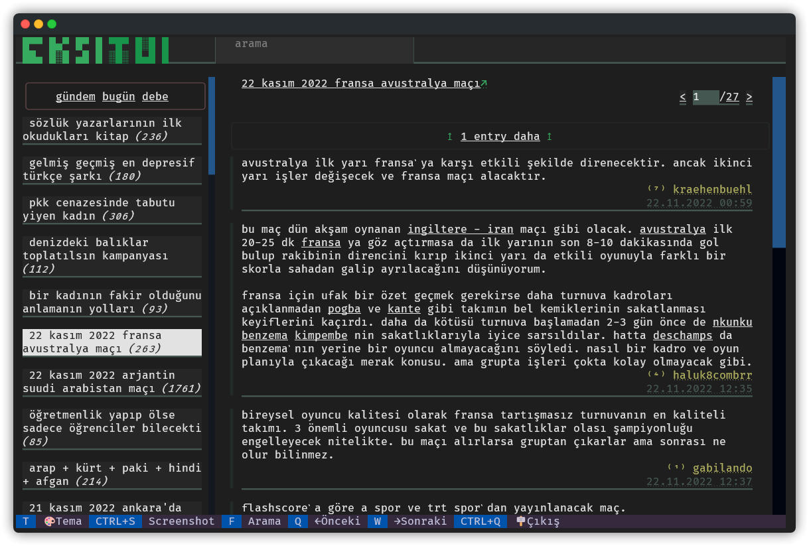

<div align="center">
<a href="https://github.com/agmmnn/nisanyan-cli">
</a>
<a href="https://pypi.org/project/nisanyan-cli/">
</a>

Terminal User Interface for Turkish collaborative hypertext dictionary [ekşi sözlük](https://eksisozluk.com/). With the power of the [textual](https://github.com/Textualize/textual) framework.

</div>

> _*ekşi sözlük* is a collaborative hypertext dictionary based on the concept of Web sites built up on user contribution. It is currently one of the largest online communities in Turkey. [-wiki](https://en.wikipedia.org/wiki/Ek%C5%9Fi_S%C3%B6zl%C3%BCk)_

> _As an online public sphere, Ekşi Sözlük is not only utilized by thousands for information sharing on various topics ranging from scientific subjects to everyday life issues, but also used as a virtual socio-political community to communicate disputed political contents and to share personal views._

## Install

```
pip install eksitui
```

## Usage

```
$ eksi
```

```
$ eksi <topic>

# directly starts the application with given topic
```

### Shourtcuts:

```python
#  T: Dark/Light Theme
#  Ctrl+S: Saves the Screenshot in app's folder
#  F: Focus Search Input
#  Ctrl+X: Clear Search Input
#  Q: Previous Page
#  W: Next Page
#  Ctrl+O: Hide/Show Footer Bar
#  Ctrl+Q: Quit
```

## Dev

```
pip install "textual[dev]"
textual run --dev eksitui.main:EksiTUIApp
```

### Dependencies

- [textual](https://pypi.org/project/textual/)
- [requests](https://pypi.org/project/requests/)

### Thanks to:

- [Ekşisözlük Unofficial API](https://github.com/e4c6/eksi_unofficial_api) by [e4c6](https://github.com/e4c6)
